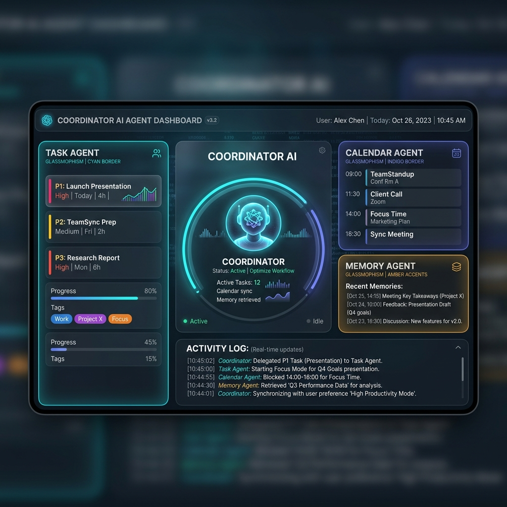
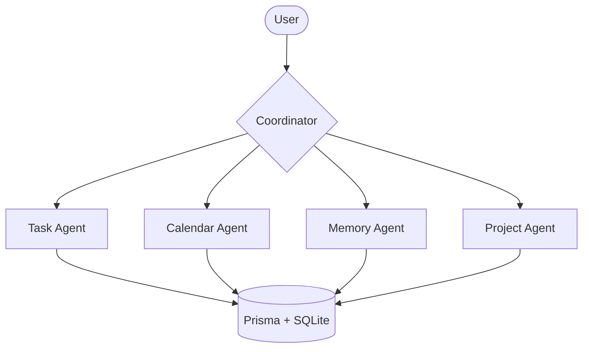

# 🤖 Multi-Agent Productivity Assistant



A powerful, high-tech multi-agent AI system designed to coordinate complex real-world workflows. Built with **Node.js**, **Express**, and **Prisma**, this system demonstrates advanced orchestration between a central **Coordinator** and specialized sub-agents.

## 🏗 System Architecture

The system follows a hub-and-spoke model where the **Coordinator** classifies intent and routes requests to the appropriate agents, often chaining multiple steps together.



## 🚀 Key Features

- **Multi-Agent Coordination**: Intelligent routing and state management across specialized agents.
- **Workflow Automation**: Handles complex multi-step scenarios (e.g., "Plan a website redesign project").
- **MCP Tool Integration**: Agents implement the **Model Context Protocol (MCP)** for standardized tool calling.
- **Persistent Memory**: Structured storage for tasks, events, and long-term memory.
- **Real-time Premium Dashboard**: A glassmorphism-style UI to monitor system state and agent activity.

## 👥 Specialized Agents

### 🧠 Coordinator
The central brain of the system. It uses AI to classify user intent and manages the execution flow of multi-agent workflows.

### ✅ Task Agent
Manages your to-do lists, sets priorities, and tracks deadlines.
- **Tools**: `createTask`, `updateTask`, `getTasks`, `deleteTask`.

### 📅 Calendar Agent
Handles scheduling, check availability, and manages events.
- **Tools**: `scheduleEvent`, `getEvents`, `findAvailableSlot`.

### 💾 Memory Agent
Stores and retrieves unstructured notes, snippets, and historical context.
- **Tools**: `saveNote`, `searchNotes`, `getNoteById`.

### 📂 Project Agent
Coordinates high-level project planning and structural management.
- **Tools**: `createProject`, `linkAgentToProject`, `getProjectStatus`.

## 🛠 Tech Stack

- **Backend**: Node.js, Express.js
- **Database**: Prisma ORM, SQLite
- **Frontend**: Vanilla JS, CSS (Premium Aesthetic)
- **AI**: Gemini API (for Intent Classification)

## 🏃 How to Run the Program

### 1. Prerequisites
- Node.js (v18+)
- A Google Gemini API Key

### 2. Environment Setup
Create a `.env` file in the root directory:
```env
DATABASE_URL="file:./prisma/dev.db"
PORT=3000
GEMINI_API_KEY=your_gemini_api_key_here
```

### 3. Install & Initialize
```bash
npm install
npm run db:push
npm run db:generate
```

### 4. Start the System
```bash
npm run dev
```
Open your browser at **[http://localhost:3000](http://localhost:3000)**.

---

## 📂 Project Structure
- `src/coordinator.js`: Main routing logic.
- `src/sub-agents/`: Specialized agent implementations.
- `src/db.js`: Database client initialization.
- `public/`: Dashboard assets.
- `assets/`: Documentation assets (images/diagrams).
- `prisma/`: Database schema and migrations.
